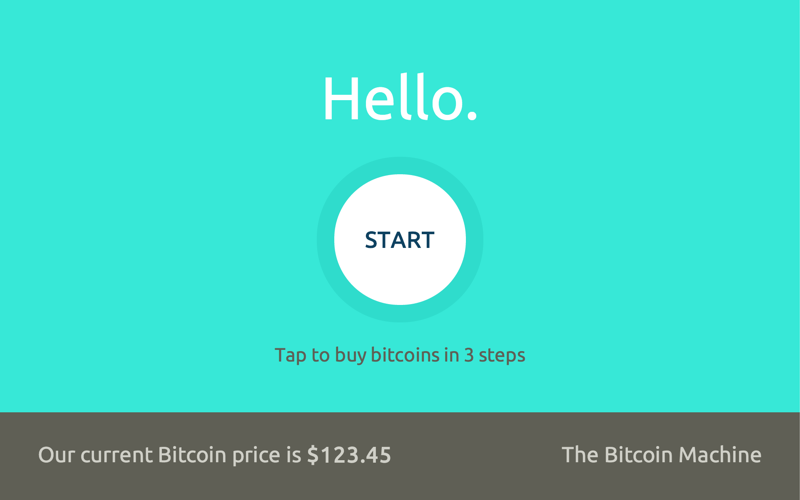

# lamassu-machine
The software that runs the Lamassu Bitcoin Machine.

## Installing

```
git clone https://github.com/lamassu/lamassu-machine.git
cd lamassu-machine
npm install
./setup.sh
```

**Prerequisites**: You'll need Node.js and Ruby installed on your machine. There packages for these on most operating systems. You'll also need compiling tools. See here: https://github.com/TooTallNate/node-gyp#installation.

## Running

First, run the mock bill validator in a separate terminal window:

```
$ ruby fake_id003.rb
```

The mock validator will output its device path, e.g. ```/dev/ttys009```.
Use that to run the main program, called lamassu-machine, along with a Bitcoin
address **you control**:

```
node bin/lamassu-machine --mockBTC 1KAkLnhU1BpvgjQUgLk1HF4PEgh4asFNS8 \
--mockBv /dev/ttys009 --mockTrader --mockCam
```

This should output something like this:

```
2014-07-18T17:00:15.052Z LOG Bitcoin Machine software initialized.
2014-07-18T17:00:15.054Z LOG new brain state: booting
2014-07-18T17:00:15.055Z LOG browser not connected
2014-07-18T17:00:15.055Z LOG new brain state: wifiConnected
2014-07-18T17:00:15.056Z LOG FSM: start [ none -> Start ]
2014-07-18T17:00:15.057Z LOG memUse: 29.4 MB, memFree: 15.0%, nodeUptime: 0.00h, osUptime: 73.63h
2014-07-18T17:00:15.059Z LOG FSM: connect [ Start -> Connected ]
2014-07-18T17:00:15.162Z LOG FSM: disable [ Connected -> Disable ]
2014-07-18T17:00:15.162Z LOG FSM: denominations [ Disable -> Denominations ]
2014-07-18T17:00:15.261Z LOG FSM: initialize [ Denominations -> Initialize ]
2014-07-18T17:00:15.375Z LOG connected to browser
2014-07-18T17:00:15.560Z LOG Bill validator connected.
2014-07-18T17:00:15.560Z LOG Using mock trader
2014-07-18T17:00:15.562Z LOG lightOff
2014-07-18T17:00:15.562Z LOG new brain state: pendingIdle
2014-07-18T17:00:15.562Z LOG new brain state: idle
2014-07-18T17:00:15.562Z LOG lightOff
2014-07-18T17:00:15.562Z LOG new brain state: pendingIdle
2014-07-18T17:00:15.562Z LOG new brain state: idle
2014-07-18T17:00:16.267Z LOG FSM: disable [ Initialize -> Disable ]
```

Now, open a Chrome or Chromium browser to

```
file:///<lamassu-machine path>/ui/start.html
```

and you should get this:



When the screen asks you to insert a bill, navigate to the terminal
where you opened the mock bill validator, and input **1**<kbd>Enter</kbd>
to insert a one dollar bill.

## Mocking

In order to easily test **lamassu-server**, you can use the ```mock``` command.
First, run lamassu-server in its own terminal:

```
LAMASSU_ENV=debug bin/lamassu-server --http
```

Now, in a separate terminal, run ```mock```:

```
node bin/mock.js -a 1KAkLnhU1BpvgjQUgLk1HF4PEgh4asFNS8
```

This will send $1 worth of bitcoins to 1KAkLnhU1BpvgjQUgLk1HF4PEgh4asFNS8, via lamassu-server.

Here's how to run it with a mock bill validator, a mock camera, currency forced to USD,
a mock bill dispenser, and using an HTTP connection to a local server. First, set
```brain.mockBTC``` to a bitcoin address in device_config.json. Then:

```
node bin/lamassu-machine --mockBv /dev/ttys009 --mockCam --fiat USD --mockBillDispenser --http
```
